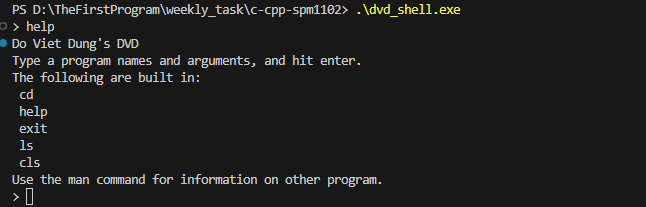

# DVD
DVD is a simple implementation of a shell in C. It demonstrates the basics of how a shell works. That is: read, parse, create process, execute, and wait. Since its purpose is for training my C skills (not feature completeness or even fitness for casual use), it has many limitations, including:

- Commands must be on a single line.
- Arguments must be separated by whitespace.
- No quoting arguments or escaping whitespace.
- No piping or redirection.
- Only builtins are: `cd`, `help`, `exit`, `ls`, `cls`.
# Running
You can use this shell simply by running the `.\bin\dvd_shell.exe\` file.
# Sample
After you run the `.\bin\dvd_shell.exe\` file, type `help` for example, the shell will give you 5 builtin functions as I mentioned above.

